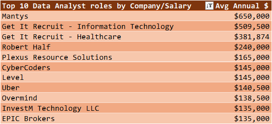
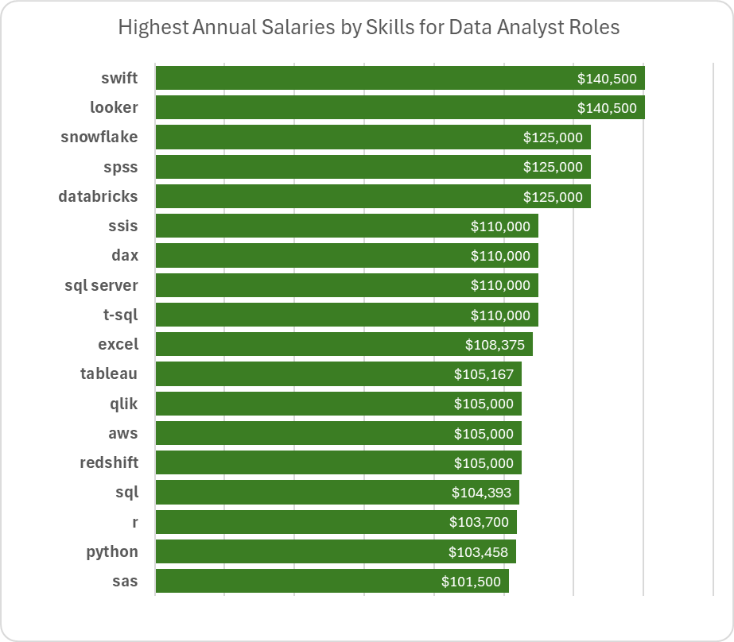
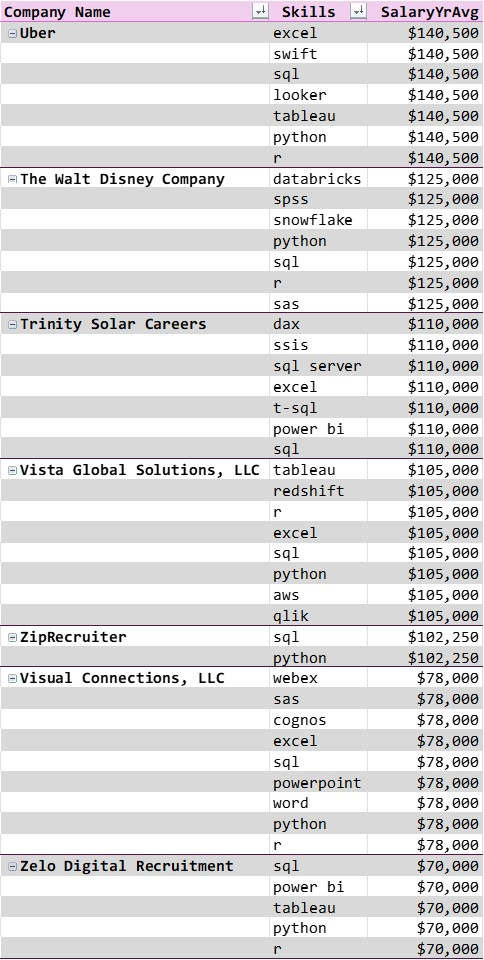
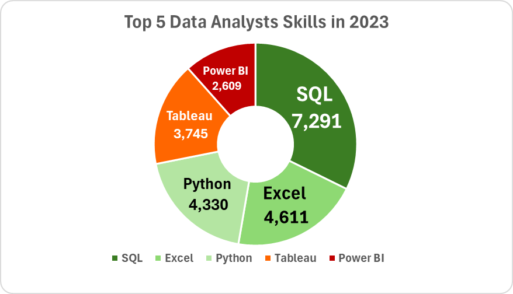
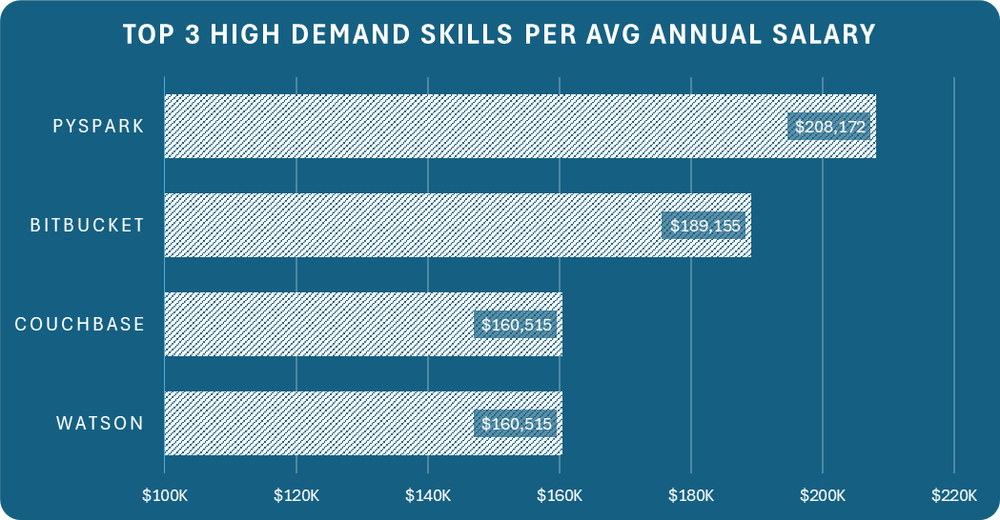
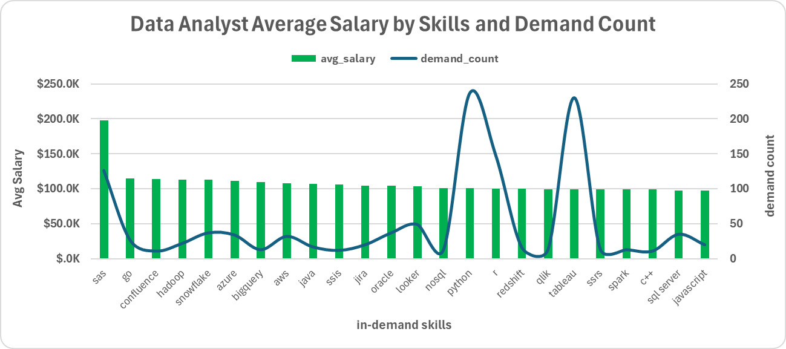
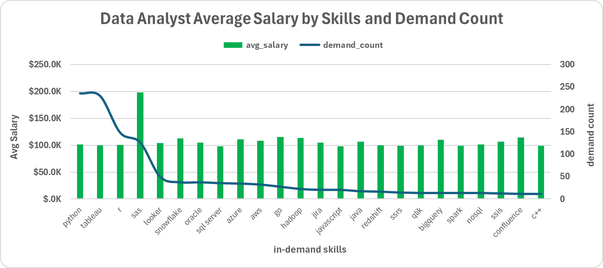

- Introduction
- Background
- Tools I used
- The Analysis
- What I learned
- Conclusions


# Introduction
This is a deep-dive into the data job market, focusing on remote data analyst roles.  The project explores top-paying roles, in-demand skills, and the intersection of where high-demand skills meet up with high salaries in data analytics.
SQL queries here:  [project_sql](/project_sql/)


# Background
This project is the capstone on an SQL course offered by Luke Barousse and Kelly Adams.  I'm grateful to them for their work in preparing and teaching the course.  [Course](https://lukebarousse.com/sql)

My participaion in the SQL course and this project as a new data analyst was two-fold.  First, I wanted to improve my SQL skills; and second, I wanted data-driven guidance on which skills to pursue for higher income returns in the larger job market.  Both of my goals and expectations were accomplished in taking this course and completing this project. 

The questions I wanted to answer through my SQL queries were the following:
1.  What are the top-paying jobs for my interested roles (primarily data analyst and business analyst)?
2.  What are the skills required for these top-paying roles?
3.  What are the most in-demand skills for my role?
4.  What are the top skills based on salary for my role?
5.  What are the most optimal skills to learn?


# Tools
For my research into the data job market, I leveraged the following tools:
- **SQL:**  query and analysis

- **Excel:**  pivot tables, charts, and analysis

- **PostgreSQL and PG Admin:**  source of Data job market data

- **Visual Studio Code:**  DB management/SQL query execution

- **Git and GitHub:**  sharing, tracking, and collaboration


# Analysis
Each of the five queries for this project were targeted at specific aspects of the Data Analyst job market.

### 1.  Top-paying Data Analyst Jobs
The purpose here was to identify the top 10 highest paying Data Analyst roles that are available remotely in 2023.  I actually filtered this initial query by both Data Analyst and Business Analyst in all possible locations for full-time positions only.  The results set which is limited to 25 records highlights the top-paying opportunities for Data Analysts and Business Analyst does not appear in the top 25.

```sql
SELECT
      DISTINCT(s.skills) AS Skills
     ,j.job_title_short
     ,s.skill_id
     ,j.job_id
     ,j.salary_year_avg

FROM
	skills_dim s

INNER JOIN
	skills_job_dim sj

ON
	sj.skill_id = s.skill_id

INNER JOIN
	job_postings_fact j	

ON
	j.job_id = sj.job_id

WHERE
	j.job_title_short LIKE '%Analyst%'

GROUP BY
	1,2,5

ORDER BY 
	5 DESC
;
```


```sql
SELECT 
	 j.job_title_short AS Job_Title
	,ROUND(AVG(j.salary_year_avg)) AS Avg_Sal
	,s.skills
        ,COUNT(s.skills) AS Count

FROM 
	skills_dim s

LEFT JOIN 
	skills_job_dim sj

ON
	s.skill_id = sj.skill_id

LEFT JOIN
	job_postings_fact j 

ON 
	j.job_id = sj.job_id

WHERE
	s.skills = 'sql'

GROUP BY
	1,3

ORDER BY
	4 DESC
;
 
```


```sql
SELECT
	 j.job_title_short AS Title
	,j.job_location AS Location
	,j.job_posted_date AT TIME ZONE 'UTC' AT TIME ZONE 'EST' AS Date
	,EXTRACT(MONTH FROM j.job_posted_date) AS Date_Month
	,EXTRACT(YEAR FROM j.job_posted_date) AS Year

FROM
	job_postings_fact j
LIMIT
	5
;


SELECT
	 j.job_title_short
	,COUNT(j.job_id) AS Job_Posted_Count
	,EXTRACT(MONTH FROM j.job_posted_date) AS Date_Month
	
FROM
	job_postings_fact j

WHERE
	j.job_title_short = 'Data Analyst'

GROUP BY
	2

ORDER BY 
	2 DESC
;


```


```sql
WITH remote_job_skills AS (
	SELECT
		 sj.skill_id
		,COUNT(*) AS skill_count
	FROM
		skills_job_dim AS sj
	INNER JOIN
		job_postings_fact AS j	
	ON 	j.job_id = sj.job_id
	WHERE
		j.job_work_from_home = true
	AND j.job_title_short = 'Data Analyst'	
	GROUP BY 
		1	
                            )
SELECT
	 s.skill_id
	,skills AS skil_name
	,skill_count
FROM 
	remote_job_skills
INNER JOIN
	skills_dim s
ON
	s.skill_id = remote_job_skills.skill_id
ORDER BY 3 DESC
LIMIT 5 
;
```


```sql
SELECT
     job_id
    ,job_title
    ,job_location
    ,job_schedule_type 
    ,salary_year_avg 
    ,job_posted_date
    ,name AS company_name

FROM 
    job_postings_fact 

LEFT JOIN 
    company_dim
ON
    job_postings_fact.company_id = company_dim.company_id

WHERE 
    job_title IN ('Data Analyst', 'Business Analyst') 
AND job_location = 'Anywhere'
AND salary_year_avg IS NOT NULL
AND job_schedule_type = 'Full-time'

ORDER BY
    5 DESC

LIMIT 
    25
;
```
The top Data Analyst jobs in 2023 range in salary from $135K to $650K and include companies like Mantys, Robert Half, and Uber.  




### 2.  Skills Required for these Top-paying Roles
This second query uses the first query and adds in the skills required for the roles.  It provides a detailed look at which high-paying jobs demand certain skills, helping job seekers understand which skills to develop that aligh with top salaries.

```sql
SELECT
	 j.job_title_short
	,j.job_location
	,CASE WHEN j.job_location = 'Anywhere' THEN 'Remote'
	      WHEN j.job_location = 'New Yord, NY' THEN 'Local'
	      ELSE 'Onsite' END AS location_category 	
FROM
	job_postings_fact j
;

SELECT	
	 COUNT(j.job_id) AS number_of_jobs
	,CASE WHEN j.job_location = 'Anywhere' THEN 'Remote'
	      WHEN j.job_location = 'New York, NY' THEN 'Local'
	      ELSE 'Onsite' END AS location_category 	
FROM
	job_postings_fact j

WHERE
	j.job_title_short = 'Data Analyst'

GROUP BY
	2
;

```


```sql
WITH top_paying_jobs AS (
SELECT
     j.job_id
    ,j.job_title
    ,ROUND(j.salary_year_avg,0) AS salary_year_avg
    ,j.job_posted_date::DATE
    ,name AS company_name

FROM 
    job_postings_fact j

LEFT JOIN 
    company_dim c
ON
    j.company_id = c.company_id

WHERE 
    j.job_title IN ('Data Analyst', 'Business Analyst') 
AND j.job_location = 'Anywhere'
AND j.salary_year_avg IS NOT NULL
AND j.job_schedule_type = 'Full-time'

ORDER BY
    5 DESC

LIMIT 
    10
			)
SELECT 
	 top_paying_jobs.*
	,s.skills

FROM top_paying_jobs
INNER JOIN
	skills_job_dim sj
ON 
	top_paying_jobs.job_id = sj.job_id
INNER JOIN
	skills_dim s
ON
	sj.skill_id = s.skill_id

ORDER BY  
  salary_year_avg DESC
;
```

The top five skills for Data Analyst yielding the highest salaries in 2023 were the following:  Swift, Looker, Snowflake, SPSS, and Databricks.  Although not in the top five, Excel was tenth, Tableau eleventh, and SQL was fifteenth.



The skills that correlate with the highest annual salaries are primarily associated with data analysis, programming, and business intelligence tools. Skills like Excel, Tableau, Looker, SQL, Python, and R are highly valued, especially at companies like Uber, 
where these skills command an average annual salary of $140,500.  Other notable skills include Swift, SPSS, SAS, and Snowflake which also offer competitive salaries.




### 3.  Most In-demand Skills for the Data Analyst Role
Query 3 looks at the most in-demand skills for the Data Analyst role by identifying the top 5 in-demand skills without respect to salary while focusing on ALL job postings.  

```sql
SELECT *

FROM 
	job_postings_fact j

INNER JOIN 
	skills_job_dim sj
ON j.job_id = sj.job_id

INNER JOIN
	skills_dim s
ON sj.skill_id = s.skill_id

LIMIT 5 
;

SELECT 
	 s.skills
	,COUNT(sj.job_id) AS demand_count

FROM 
	job_postings_fact j

INNER JOIN 
	skills_job_dim sj
ON j.job_id = sj.job_id

INNER JOIN
	skills_dim s
ON sj.skill_id = s.skill_id

WHERE
	j.job_title_short = 'Data Analyst'

AND j.job_work_from_home = TRUE

GROUP BY
    s.skills

ORDER BY 2 DESC

LIMIT 5
;
```

The top 5 skills for Data Analysts are SQL, Excel, Python, Tableau, and Power BI.  There is no significant change when this is narrowed to remote locations only; and the proportions remain relatively similar regardless of locale.




### 4.  Top Skills Based on Salary for the Data Analyst Role
Query 4 pursues the top skills based on salary by examining the average salary associated with each skill for Data Analyst positions.  It focuses on roles with specified salaries, regardless of location and reveals how different skills impact salary levels for Data Analysts, helping to identify the most financially rewarding skills to acquire or improve.

```sql
SELECT 
	 s.skills
	,ROUND(AVG(j.salary_year_avg),0) AS avg_salary
      --,COUNT(sj.job_id) AS demand_count

FROM 
	job_postings_fact j

INNER JOIN 
	skills_job_dim sj
ON j.job_id = sj.job_id

INNER JOIN
	skills_dim s
ON sj.skill_id = s.skill_id

WHERE
	j.job_title_short = 'Data Analyst'

AND j.salary_year_avg IS NOT NULL

AND j.job_work_from_home = TRUE


GROUP BY
	s.skills

ORDER BY 2 DESC

LIMIT 25
;
```

The top three high-demand skills based on average salary are so listed due to their critical roles in data processing, software development, and AI.  The following summary of the top three results comes from MS Bing Co-Pilot:

1. PySpark ($208,172): a powerful tool for big data processing and analytics. Its integration with Apache Spark allows for efficient handling of large datasets, making it highly valuable in industries that rely on data-driven decision-making.

2. Bitbucket ($189,155): a Git repository management solution designed for professional teams. Its high demand is driven by its robust features for code collaboration, continuous integration, and deployment, which are essential for modern software development practices.

3. Couchbase and Watson ($160,515 each):   
     - Couchbase is a NoSQL database and is known for its high performance and scalability, making it ideal for applications requiring real-time data processing and large-scale data management.
     - Watson -IBM's Watson offers advanced AI and machine learning capabilities, which are crucial for businesses looking to leverage AI for insights, automation, and enhanced decision-making.




### 5.  High-demand and High-salary Skills for Data Analyst Roles
This last query identifies skills in high demand associated with high average salaries for Data Analyst roles.  It concentrates on remote positions with specified salaries and targets skills that offer job security (high demand) and financial benefits (high salaries), offering strategic insights for career development in data analysis.

```sql
WITH skills_demand AS (
			SELECT 
				 s.skill_id
				,s.skills
				,COUNT(sj.job_id) AS demand_count

			FROM 
				job_postings_fact j

			INNER JOIN 
				skills_job_dim sj
			ON j.job_id = sj.job_id

			INNER JOIN
				skills_dim s
			ON sj.skill_id = s.skill_id

			WHERE
				j.job_title_short = 'Data Analyst'

			AND j.salary_year_avg IS NOT NULL

			AND j.job_work_from_home = TRUE

			GROUP BY
				s.skill_id
                       )

    ,average_salary AS (
			SELECT 
				 s.skill_id
				,s.skills
				,ROUND(AVG(j.salary_year_avg),0) AS avg_salary
			      --,COUNT(sj.job_id) AS demand_count

			FROM 
				job_postings_fact j

			INNER JOIN 
				skills_job_dim sj
			ON j.job_id = sj.job_id

			INNER JOIN
				skills_dim s
			ON sj.skill_id = s.skill_id

			WHERE
				j.job_title_short = 'Data Analyst'

			AND j.salary_year_avg IS NOT NULL

			AND j.job_work_from_home = TRUE

			GROUP BY
				s.skill_id

                       )

SELECT
	 skills_demand.skill_id
	,skills_demand.skills
	,demand_count
	,avg_salary

FROM
	skills_demand

INNER JOIN
	average_salary
	
ON
	skills_demand.skill_id = average_salary.skill_id

WHERE
	demand_count > 10

ORDER BY	
	3 DESC,4 DESC

LIMIT 25
;

```


```sql
--the previous CTE query is more streamlined below
SELECT 
	 s.skill_id
	,s.skills
        ,COUNT(sj.job_id) AS demand_count
	,ROUND(AVG(j.salary_year_avg),0) AS avg_salary

FROM 
	job_postings_fact j

INNER JOIN 
	skills_job_dim sj
ON j.job_id = sj.job_id

INNER JOIN
	skills_dim s
ON sj.skill_id = s.skill_id

WHERE
	j.job_title_short = 'Data Analyst'

AND j.salary_year_avg IS NOT NULL

AND j.job_work_from_home = TRUE


GROUP BY
	s.skill_id

HAVING
	COUNT(sj.job_id) > 10

ORDER BY 4 DESC, 3 DESC

LIMIT 25
;
```

The 5 most in-demand skills for remote data analysts are the following: Python, Tableau, R, SAS, and Looker.  







# What I Learned
This was my first project outside of my professional environment and has proven to be a great learning experience for me.  From an SQL standpoint, it included a good mix of intermediate and advanced concepts like CASE, JOINS, SUBQUERIES, CTE's, AGGREGATIONS, GROUP BY, HAVING, ROUND, Date Functions, and various Filtering and Sorting.  

My personal interest in this project was for the sake of knowing what skills to pursue for my own growth and development.  My revised learning path for data analysis is now driven by the data contained in this project as well as my awareness of what is in demand for my current and prospective professional roles.


# Conclusion

### Insights

1.  **Top-paying Data Analyst Jobs**:  The highest-paying full-time jobs for data analysts that allow remote work offer a very wide range of salaries ($135K to $650K)!

2.  **Skills for Top-Paying Jobs**:  High-paying data analyst jobs require advanced proficiency in SQL, demonstrating its crucial role for those interested in the highest salaries.

3.  **Most In-demand Skills**:  SQL is also the most demanded skill in the data analyst job market, further emphasizing its importance.

4.  **Skills with Higher Salaries**:  Specialized skills, such as Pyspark and Bitbucket are associated with the highest average salaries, indicating a premium on niche expertise.

5.  **Optimal Skills for Job Market Value**:  Python, Tableau, R, and SAS are among the most in-demand skills for data analysts in 2023 appearing 3-4 times more often than any other skill.


### Closing Thoughts
This project significantly enhanced my SQL and problem-solving skills and provided an avenue for me to complete an entire project from questions to action (what are the in-demand skills to target for data analysts who are pursuing larger salaries).  I now know what to focus on personally for my continuing growth and development; and based on the data, I am confident that I can continue to move forward in pursuing the right skills for the roles I have targeted.  Thanks for reviewing my project.  Hopefully, there were some insights here that you found helpful too.
